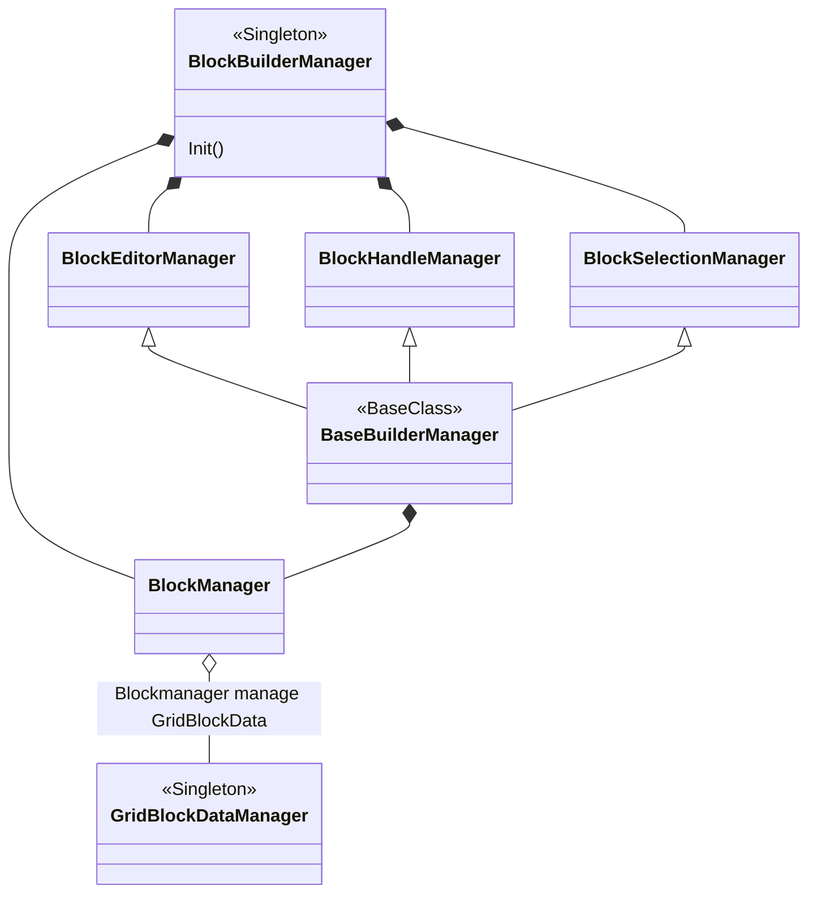

# MUGCUP Block Builder for Unity

#### Created by Sukum Duangpattra [MUGCUP], using Unity [version 2020.3.22.f1]

## Introduction

Block Builder project is an attempt to create a flexible tile block editor tool in Unity.

## Features
<ul>
    <li>Generate grid blocks and edit blocks.</li>
</ul>

## Documentation

### BlockBuilderManager.cs
BlockBuilderManager manage all grid block data initializations and dependencies. GridDataManger
is initialized through this. BlockBuilderManager can choose to swap GridDataManagers when needed.

### GridDataManager.cs
GridDataManager holds all grid block data. The manager resides inside BlockBuilderManager.cs.

## Dependencies

